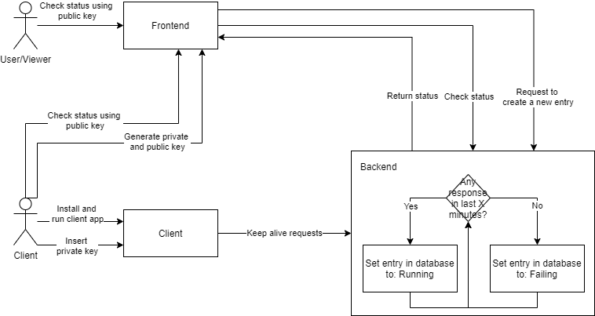
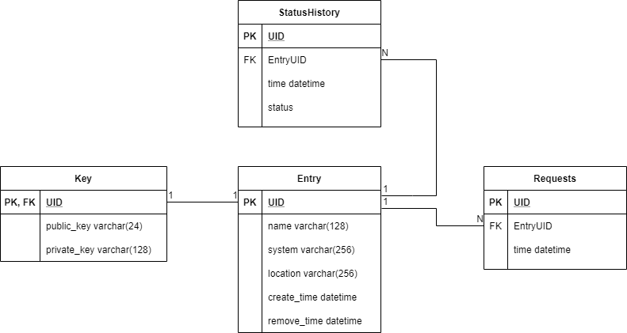

# IS ALIVE CONNECTION (IAC)

## Disclaimer

Information below are concepts of the project and may vary from actuall implementation, this will be replaced on the public release of the app.  

## About

IAC is a monitoring system for your computer connection to the network using a pair of private and public key. Project is contained as backend for handling request and database of keys, frontend as webpage that is visible on the web and allows user to create a new key or check currently used ones and the client app that is run on designated operating system to send signals that the device is alive. All of this is more like a proof of concept that a real life application.

### Flow of project

The core idea was to check if some device crashed or lost access to the Internet. Device sends a requests to the backend that are verified. If after some time there is no response it means that there is a problem and status in frontend will change from something like `up and running` to `there is some issues`. All of which is described in the diagram below.

### Concept of keys

Anyone is able to create a pair of keys, one public that anyone can use and other private that is used in client application for sending requests and verifying the system that it is running on. Private key is only displayed once while creating it. To remove entry the private key must be provided and then it will be removed. On the basics private key is longer and composed of many informationg that goes into it. Public key on another hand is simple random 24 ASCII characters meant to be placed in the url as well as inputing it in front.

## Database and storing the data

Data stored is simple and user is not required to input any specific information as any information that is provided will be displayed when accessing using the public key. Also keys could be bruteforced and spoofed for information, by this the requied information is also very minimal.

The basic information that is stored when creating a new entry is:

- name
- running operating system (optional)
- location (optional)
- time of creation

All of this plus the keys and all requests database composes to schematic below.

Requests are a temporary table where recent requests are kept for checking the status if got any. StatusHistory table in another hand is updated based on Requests table in larger waits between each update. All of this is handled by backend and the StatusHistory is the table that is queried when user checks info in frontend.

## Backend

Some writing about endpoints

## Frontend

Something about React or other js framework used for this.

## Client

Request Client
